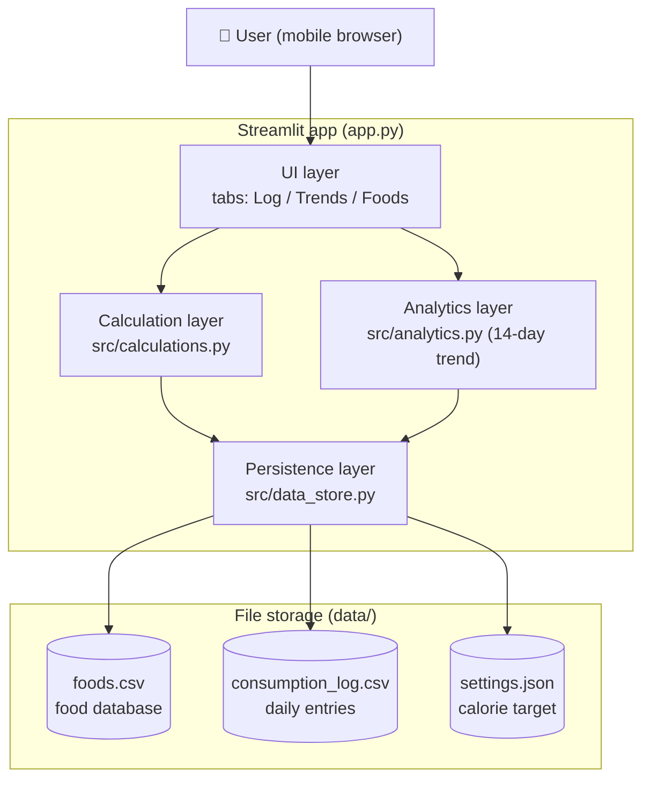

# Calorie Calculator — Technical Architecture

Single-user, mobile-friendly calorie tracker for Indian foods. Python + Streamlit,
CSV storage, no database, no auth, no APIs.

## 1. High-level architecture



Three thin layers behind the UI:

| Layer | File | Responsibility |
|---|---|---|
| UI | `app.py` | Tabs, forms, metrics, chart rendering. No file I/O, no math. |
| Calculation | `src/calculations.py` | Pure functions: per-food calories, daily total, remaining. |
| Analytics | `src/analytics.py` | 14-day aggregation + Altair chart spec. |
| Persistence | `src/data_store.py` | The only module that touches the CSV/JSON files. |

## 2. Project structure

```
calorie_Calculator/
├── app.py                    # Streamlit entry point (UI only)
├── src/
│   ├── __init__.py
│   ├── data_store.py         # CSV/JSON read-write (single point of file I/O)
│   ├── calculations.py       # calorie math (pure functions)
│   └── analytics.py          # 14-day aggregation + chart
├── data/
│   ├── foods.csv             # food database (111 Indian foods, editable)
│   ├── consumption_log.csv   # created on first entry
│   └── settings.json         # created when target is changed
├── .streamlit/config.toml    # theme + server config
├── requirements.txt
├── README.md
└── ARCHITECTURE.md
```

## 3. CSV schemas

**`data/foods.csv`** — one row per food:

| column | type | example |
|---|---|---|
| `food_name` | str, unique | `Masala Dosa` |
| `category` | `Veg` / `Non-Veg` | `Veg` |
| `food_group` | Staple/Breakfast/Curry/Snack/Sweet/Dairy/Beverage/Fruit | `Breakfast` |
| `serving_unit` | str, human-readable | `1 dosa` |
| `calories_per_serving` | number | `270` |

```csv
food_name,category,food_group,serving_unit,calories_per_serving
Plain Roti / Chapati,Veg,Staple,1 medium roti,100
Chicken Biryani,Non-Veg,Staple,1 cup,290
Masala Dosa,Veg,Breakfast,1 dosa,270
Gulab Jamun,Veg,Sweet,1 piece,150
```

**`data/consumption_log.csv`** — one row per logged entry (append-only, delete by row):

| column | type | example |
|---|---|---|
| `date` | ISO string `YYYY-MM-DD` | `2026-08-22` |
| `food_name` | str | `Masala Dosa` |
| `quantity` | number (servings) | `1.5` |
| `serving_unit` | str (denormalized copy for display) | `1 dosa` |
| `calories` | number (already multiplied — historical rows never change if the food DB is edited) | `405` |

**`data/settings.json`** — `{"daily_target": 2000}`.

## 4. Data flow: adding food & calculating daily calories

1. User picks a date (defaults to today), searches a food in the selectbox, enters quantity, taps **Add food**.
2. `app.py` looks up the food row, calls `calculations.calories_for(kcal_per_serving, quantity)`.
3. `data_store.append_log_entry()` appends one row to `consumption_log.csv` with the **computed** calories.
4. `st.rerun()` reloads: the log is re-read, `calculations.total_for_date()` sums today's rows, `remaining = target − consumed`, and the three metrics (Consumed / Target / Remaining) update. Over-target shows a warning banner.
5. Deleting an entry drops that row by index and rewrites the CSV.

Calories are stored **at log time** so editing a food's calories later never rewrites history.

## 5. Historical 14-day storage & analytics

- The log CSV is the single source of history — no separate history file; it simply accumulates (a year of 5-meal days ≈ 1800 rows, trivially small).
- `analytics.daily_totals_14d()` builds a fixed 14-day date spine ending today, left-joins `groupby(date).sum(calories)`, and fills missing days with 0 — so the chart always shows exactly 14 bars, including empty days.
- Chart: Altair bar chart, bars colored by status (blue `#2a78d6` under target, red `#d03b3b` over), dashed gray rule at the target, tooltips per bar, plus a table view and summary metrics (daily average, days over target, days logged).

## 6. UI layout (mobile wireframe)

```
┌──────────────────────────────┐
│ 🍛 Calorie Calculator        │
│ [Log] [Trends] [Foods]       │
├──────────────────────────────┤
│ Log tab                      │
│  Date: [2026-08-22 v]        │
│  Food: [type to search... v] │
│  Qty:  [ 1.0  - + ]          │
│  [       + Add food        ] │
│  ┌────────┬────────┬───────┐ │
│  │Consumed│ Target │Remain.│ │
│  │  1450  │  2000  │  550  │ │
│  └────────┴────────┴───────┘ │
│  Entries — 22 Aug            │
│  Masala Dosa · 1 x .. 270 [x]│
│  Dal Tadka   · 1 x .. 180 [x]│
├──────────────────────────────┤
│ Trends tab                   │
│  ▂▅▃█▄▆▅▃▇▄▅▆▃▅  (14 bars)   │
│  ---- target line ----       │
│  avg | days over | logged    │
├──────────────────────────────┤
│ Foods tab                    │
│  add-food form + searchable  │
│  database table (111 items)  │
└──────────────────────────────┘
```

Mobile choices: `layout="centered"` (single column), tabs instead of sidebar navigation, full-width ≥ 2.8 rem buttons, metrics that stack on narrow screens, searchable selectbox instead of scrolling a long list, sidebar reserved for the rarely-used target setting.

## 7. Libraries

| Library | Why |
|---|---|
| `streamlit` | UI, widgets, tabs, metrics, hosting target |
| `pandas` | CSV read/write, groupby aggregation |
| `altair` | 14-day chart (declarative, ships with Streamlit's chart API) |

Standard library only beyond that (`pathlib`, `json`, `datetime`). Deliberately **no** SQLite/Postgres, no auth, no REST API, no ORM.

## 8. Implementation plan (as built)

1. Food dataset — `data/foods.csv`, 111 Indian foods with serving-based calories.
2. Persistence layer — `src/data_store.py` (all file I/O in one module).
3. Calculation layer — `src/calculations.py` (pure functions, easily testable).
4. Analytics layer — `src/analytics.py` (14-day spine + Altair chart).
5. UI — `app.py` with three tabs (Log / Trends / Foods) and mobile CSS.
6. Config — `requirements.txt`, `.streamlit/config.toml`, `.gitignore`.
7. Smoke test locally (`streamlit run app.py`), then deploy (README).

## 9. Deployment (GitHub + Streamlit Community Cloud)

1. Push this folder to a GitHub repo (public or private).
2. At [share.streamlit.io](https://share.streamlit.io) → **New app** → pick the repo/branch, main file `app.py` → Deploy.
3. Streamlit Cloud installs `requirements.txt` automatically; every `git push` redeploys.
4. On your phone, open the app URL and **Add to Home Screen** for an app-like experience.

## 10. Assumptions & limitations

- **Single user, no auth** — anyone with the URL can use a deployed instance. For personal use, deploy from a private repo and keep the URL to yourself (or just run locally).
- **Ephemeral storage on Streamlit Cloud**: the container's filesystem resets on redeploy/restart, so entries logged *on the cloud instance* can be lost. Options, simplest first:
  1. **Run locally** (`streamlit run app.py`, open from your phone via your PC's LAN IP) — files persist on your disk. Recommended.
  2. Periodically download/commit `data/consumption_log.csv` to the repo (it is intentionally *not* gitignored).
  3. If cloud persistence ever becomes a real need, swap `data_store.py` for a Google-Sheets or gist backend — the rest of the app wouldn't change, since all I/O is in that one module.
- Calorie values are typical approximations for standard Indian servings; real dishes vary with oil/ghee. Edit `foods.csv` to match your kitchen.
- Quantity is in **servings** of the stated unit (1.5 × "1 cup"), not grams.
- Concurrent writes aren't guarded — fine for one person, by design.
- Trend window is fixed at 14 days (one constant in `analytics.py` to change).
